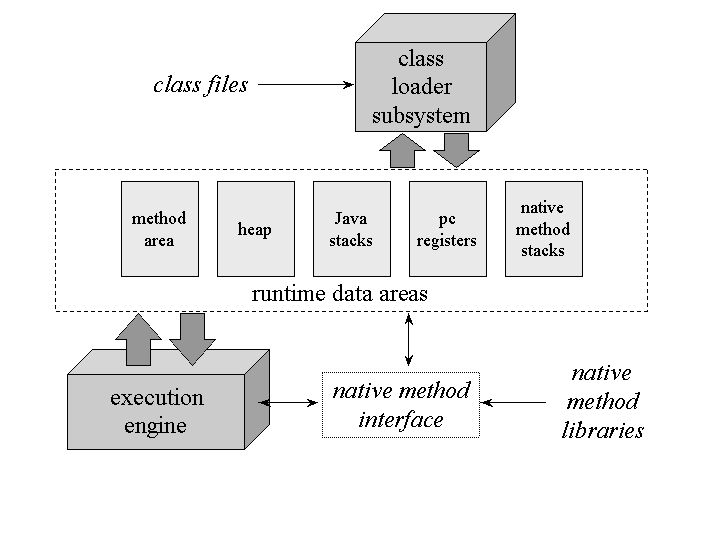

[[]]

[2024.05.27 키워드 정리](키워드%20정리%20최종본/2024.05.27%20키워드%20정리.md)

[2024.05.28 키워드 정리](키워드%20정리%20최종본/2024.05.28%20키워드%20정리.md)

[2024.05.29 키워드 정리](키워드%20정리%20최종본/2024.05.29%20키워드%20정리.md)

jvm 같은 단어 링크 적어서 찾아보기 쉽게 가능

#해시태그
#자바기초
#연산자
#5월28일

[나무위키](https://namu.wiki/w/%EB%82%98%EB%AC%B4%EC%9C%84%ED%82%A4:%EB%8C%80%EB%AC%B8)

